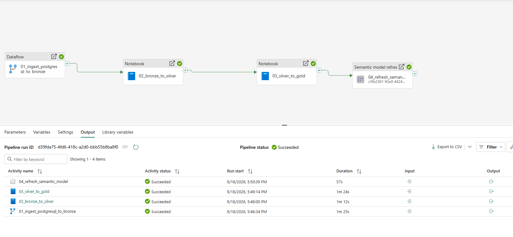
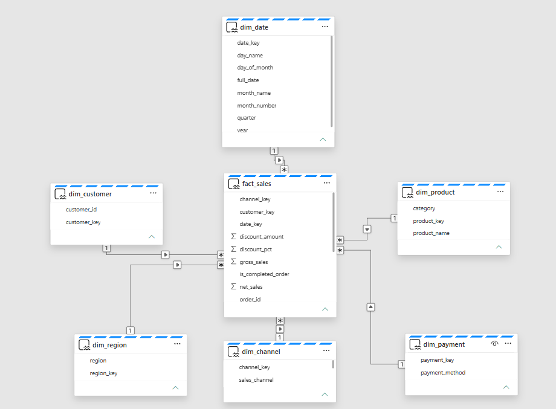
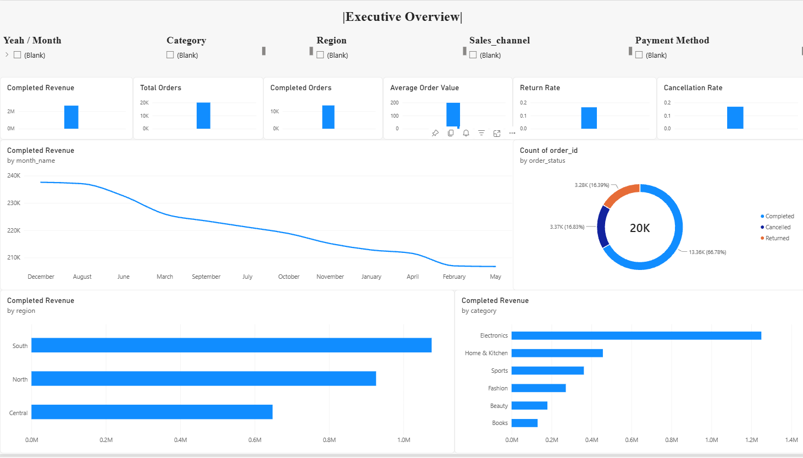
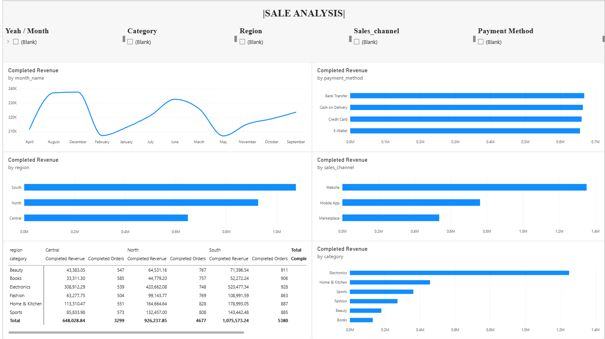
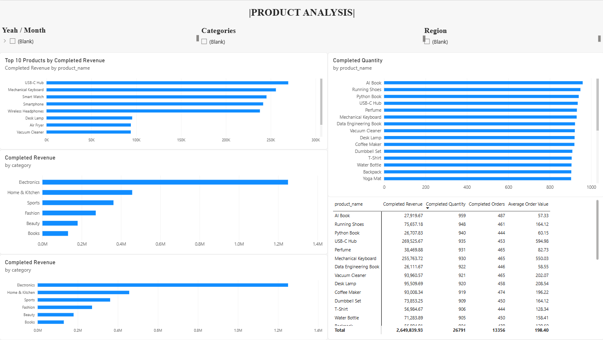

# E-commerce Analytics Platform with Microsoft Fabric

## Overview

This project implements an end-to-end data engineering and analytics pipeline using Microsoft Fabric.

E-commerce transactional data is ingested from a local PostgreSQL database through an on-premises data gateway and Dataflow Gen2, processed through Bronze, Silver, and Gold layers in a Fabric Lakehouse, modeled as a dimensional star schema, and served to Power BI through Direct Lake on OneLake.

The complete workflow is orchestrated using a Microsoft Fabric Data Pipeline.

---

## Architecture

```text
Local PostgreSQL
        |
        v
On-premises Data Gateway
        |
        v
Dataflow Gen2
        |
        v
Microsoft Fabric Lakehouse
        |
        v
Bronze
bronze_ecommerce_sales
        |
        v
Fabric Notebook
nb_bronze_to_silver
        |
        v
Silver
silver_ecommerce_sales
        |
        v
Fabric Notebook
nb_silver_to_gold
        |
        v
Gold Star Schema
        |
        v
Direct Lake on OneLake
        |
        v
Semantic Model
        |
        v
Power BI

The workflow is orchestrated with a Microsoft Fabric Data Pipeline.

Technology Stack
Layer	Technology
Source	PostgreSQL
Local-to-cloud connectivity	On-premises Data Gateway
Ingestion	Dataflow Gen2
Storage	Microsoft Fabric Lakehouse / OneLake
Processing	Apache Spark / Fabric Notebooks
Table format	Delta Lake
Data architecture	Bronze / Silver / Gold
Dimensional modeling	Star Schema
Semantic layer	Direct Lake on OneLake
Visualization	Power BI
Orchestration	Microsoft Fabric Data Pipeline
Dataset

The source dataset contains:

20,000 e-commerce orders
Data from 2025-01-01 to 2025-12-31
16 source attributes

The dataset grain is:

One row represents one order.

Core attributes include:

order_id
order_date
customer_id
product_id
product_name
category
region
sales_channel
payment_method
quantity
unit_price
discount_pct
order_status
gross_sales
discount_amount
net_sales
Medallion Architecture
Bronze

Raw source data is ingested from PostgreSQL into:

dbo.bronze_ecommerce_sales

Validation result:

Rows:            20,000
Distinct orders: 20,000
Silver

The Bronze layer is transformed through:

nb_bronze_to_silver

The resulting table is:

dbo.silver_ecommerce_sales

Silver processing includes:

string normalization
explicit data type enforcement
business-rule validation
numeric validation
monetary validation
derived date attributes
completed-order indicator

Validation result:

Rows:            20,000
Distinct orders: 20,000
Gold

The Gold layer uses a dimensional star schema.

Tables:

fact_sales
dim_date
dim_product
dim_customer
dim_region
dim_channel
dim_payment

Dimension sizes:

dim_product       30
dim_customer    7,324
dim_region          3
dim_channel         3
dim_payment         4
dim_date          365

Fact validation:

fact_sales rows        20,000
distinct orders        20,000

missing date keys           0
missing customer keys       0
missing product keys        0
missing region keys         0
missing channel keys        0
missing payment keys        0
Data Quality

Data profiling was performed before dimensional modeling.

The following checks returned zero invalid records:

missing order IDs
missing order dates
missing customer IDs
missing product IDs
invalid quantities
invalid unit prices
invalid discount percentages
negative sales values

Financial formulas were also validated:

gross_sales
= quantity * unit_price

discount_amount
= gross_sales * discount_pct / 100

net_sales
= gross_sales - discount_amount

All formula mismatch checks returned zero.

Dimensional Modeling Decisions

Profiling revealed that the source product_id was not a stable identifier for a single product.

A single product ID could be associated with multiple product names and categories.

However, the following relationship was stable:

product_name -> category

The product dimension was therefore modeled using the stable product-name/category relationship instead of blindly treating the source product ID as a dimensional business key.

Customer profiling also showed that a customer could appear in multiple regions.

Region was therefore modeled as a separate dimension instead of as a fixed customer attribute.

Semantic Model

The Gold tables are exposed through a semantic model using:

Direct Lake on OneLake

Relationships follow the star-schema pattern:

Dimension 1 ---- * fact_sales

with single-direction filtering from dimensions to the fact table.

Business measures include:

Completed Revenue
Total Orders
Completed Orders
Cancelled Orders
Returned Orders
Average Order Value
Completed Quantity
Return Rate
Cancellation Rate
Power BI Report

The report contains three pages:

Executive Overview

High-level business KPIs and trends.

Sales Analysis

Analysis by:

month
category
region
sales channel
payment method
Product Analysis

Analysis includes:

top products by revenue
revenue by category
product quantity
average order value
product performance matrix
Pipeline Orchestration

Microsoft Fabric Data Pipeline orchestrates the complete workflow:

01_ingest_postgresql_to_bronze
             |
             v
02_bronze_to_silver
             |
             v
03_silver_to_gold
             |
             v
04_refresh_semantic_model

The complete end-to-end pipeline has successfully executed.

Final validation:

Bronze: 20,000 rows
Silver: 20,000 rows
Gold:   20,000 rows
Repository Structure
ecommerce-fabric-data-platform/
|
├── README.md
├── docs/
│   ├── architecture.md
│   ├── data-quality.md
│   ├── dimensional-model.md
│   └── screenshots/
│
├── notebooks/
│   ├── nb_bronze_to_silver.sql
│   └── nb_silver_to_gold.sql
│
└── sql/
    └── validation_queries.sql
Project Outcome

This project demonstrates practical experience with:

PostgreSQL ingestion
hybrid local/cloud connectivity
Microsoft Fabric
Dataflow Gen2
Medallion Architecture
Delta Lake
Apache Spark
data quality validation
dimensional modeling
Direct Lake
Power BI
workflow orchestration

## Project Evidence

### End-to-End Fabric Pipeline

The complete workflow is orchestrated through Microsoft Fabric Data Pipeline.

```text
Dataflow Gen2
    ↓
Bronze
    ↓
Bronze-to-Silver Notebook
    ↓
Silver
    ↓
Silver-to-Gold Notebook
    ↓
Gold Star Schema
    ↓
Semantic Model Refresh
```

The end-to-end pipeline completed successfully.



---

### Gold Semantic Model

The analytical model follows a star-schema design with `fact_sales`
at the center and six dimensions.



The final Gold model contains:

```text
fact_sales

dim_date
dim_customer
dim_product
dim_region
dim_channel
dim_payment
```

All dimension relationships use a one-to-many pattern toward the fact table
with single-direction filtering.

---

### Executive Overview

The Executive Overview provides high-level operational and revenue KPIs.



Key measures include:

- Completed Revenue
- Total Orders
- Completed Orders
- Average Order Value
- Return Rate
- Cancellation Rate

---

### Sales Analysis

The Sales Analysis page supports interactive analysis across:

- month
- category
- region
- sales channel
- payment method



---

### Product Analysis

The Product Analysis page focuses on product and category performance.



Analysis includes:

- top products by completed revenue
- revenue by category
- completed quantity by product
- average order value by product
- product performance matrix

---

## Technical Documentation

Detailed engineering documentation is available in:

- [Architecture](docs/architecture.md)
- [Data Quality](docs/data-quality.md)
- [Dimensional Model](docs/dimensional-model.md)
- [Validation Queries](sql/validation_queries.sql)
- [Bronze to Silver Transformation](notebooks/nb_bronze_to_silver.sql)
- [Silver to Gold Transformation](notebooks/nb_silver_to_gold.sql)