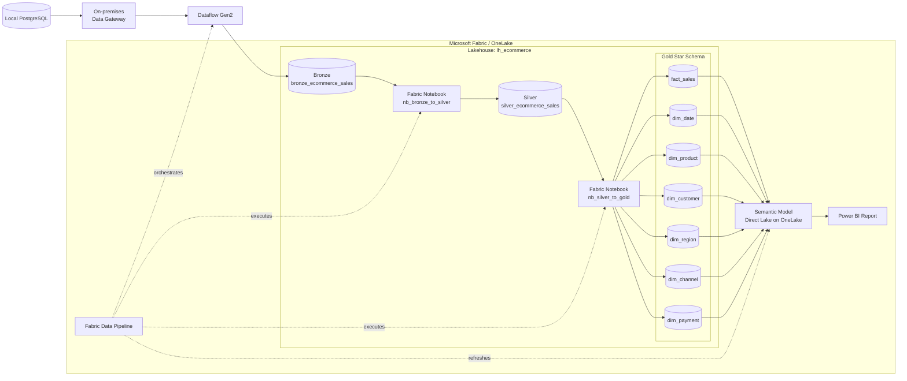
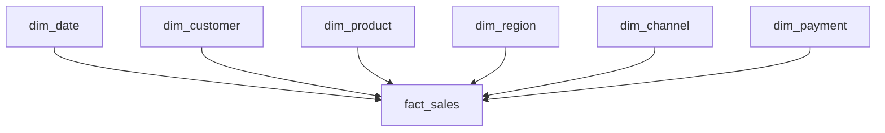
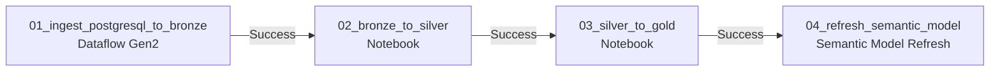

# Architecture

## 1. Architecture Overview

This project implements an end-to-end analytics platform using Microsoft Fabric.

The system ingests transactional e-commerce data from a local PostgreSQL database,
moves the data into Microsoft Fabric through an on-premises data gateway,
processes it using a Bronze-Silver-Gold medallion architecture,
builds a dimensional star schema, and serves analytical data to Power BI through
Direct Lake on OneLake.

Microsoft Fabric Data Pipeline orchestrates the complete workflow.

---

## 2. End-to-End Architecture



---

## 3. Data Flow

The data moves through the platform in the following sequence:

```text
Local PostgreSQL
        |
        v
On-premises Data Gateway
        |
        v
Dataflow Gen2
        |
        v
bronze_ecommerce_sales
        |
        v
nb_bronze_to_silver
        |
        v
silver_ecommerce_sales
        |
        v
nb_silver_to_gold
        |
        v
Gold Star Schema
        |
        v
Direct Lake Semantic Model
        |
        v
Power BI
```

The pipeline preserves a clear separation between ingestion,
data quality processing, dimensional modeling, and analytical serving.

---

## 4. Source Layer

The source system is a local PostgreSQL database.

Database:

```text
ecommerce_sales_fabric
```

The source contains 20,000 e-commerce order records covering:

```text
2025-01-01 -> 2025-12-31
```

The source table contains 16 attributes including order,
customer, product, sales channel, payment, quantity, pricing,
discount, status, and sales measures.

The source grain is:

> One row represents one order.

Because PostgreSQL runs on a local machine and Microsoft Fabric is cloud-hosted,
Fabric cannot access `localhost` directly.

An on-premises data gateway is therefore used to establish the
local-to-cloud connection.

---

## 5. Ingestion Layer

Data ingestion is performed with Dataflow Gen2.

```text
PostgreSQL
    |
    v
On-premises Data Gateway
    |
    v
Dataflow Gen2
    |
    v
Fabric Lakehouse
```

The Dataflow Gen2 activity reads the PostgreSQL source and writes the data into:

```text
dbo.bronze_ecommerce_sales
```

The Bronze layer contains:

```text
20,000 rows
20,000 distinct orders
```

The Bronze layer intentionally performs minimal business transformation.

Its purpose is to preserve source data as closely as possible while providing
a reliable Lakehouse landing layer for downstream processing.

---

## 6. Medallion Architecture

### 6.1 Bronze Layer

Table:

```text
dbo.bronze_ecommerce_sales
```

Responsibilities:

```text
Source-aligned storage
Traceability
Initial ingestion validation
Minimal transformation
```

The Bronze layer is not responsible for applying business filtering or
removing valid business states such as cancelled or returned orders.

---

### 6.2 Silver Layer

Transformation notebook:

```text
nb_bronze_to_silver
```

Output:

```text
dbo.silver_ecommerce_sales
```

The Silver layer performs:

```text
String trimming
Explicit data type enforcement
NULL validation
Numeric validation
Business-rule validation
Financial formula validation
Derived date attributes
Completed-order indicator
```

Derived fields include:

```text
order_year
order_month
is_completed_order
```

After transformation:

```text
Silver rows:       20,000
Distinct orders:   20,000
```

No source orders were lost during the Bronze-to-Silver transformation.

---

### 6.3 Gold Layer

Transformation notebook:

```text
nb_silver_to_gold
```

The Gold layer converts the cleaned transactional dataset into a dimensional
star schema optimized for analytics.



Gold tables:

```text
fact_sales
dim_date
dim_product
dim_customer
dim_region
dim_channel
dim_payment
```

Dimension sizes:

```text
dim_product       30
dim_customer    7,324
dim_region          3
dim_channel         3
dim_payment         4
dim_date          365
```

Fact validation:

```text
fact_sales rows        20,000
distinct orders        20,000

missing date keys           0
missing customer keys       0
missing product keys        0
missing region keys         0
missing channel keys        0
missing payment keys        0
```

This verifies that dimensional joins neither duplicated nor removed
transaction records.

---

## 7. Dimensional Modeling Decisions

The initial assumption was that `product_id` could be used as the natural
business key for the product dimension.

Data profiling showed this assumption was invalid.

Observed profiling results:

```text
Distinct product IDs:            899
Distinct product names:           30
Distinct categories:               6
Distinct product combinations: 14,134
```

A single `product_id` could map to multiple product names and categories.

However, the relationship:

```text
product_name -> category
```

was stable for the observed dataset.

Therefore, the Gold product dimension is based on the stable
product-name/category relationship rather than blindly treating the source
`product_id` as a reliable dimensional business key.

The original product ID is retained as a source attribute where traceability
is useful.

Customer profiling produced a similar modeling decision.

A single `customer_id` could appear in multiple regions.

Therefore:

```text
customer_id -> region
```

was not treated as a fixed dependency.

Region was modeled as an independent dimension:

```text
dim_customer
dim_region
```

This prevents incorrectly treating region as a permanent customer attribute.

---

## 8. Fact Table Grain

The grain of `fact_sales` is:

> One row represents one order.

Validation confirmed:

```text
fact_sales rows  = 20,000
distinct orders  = 20,000
```

The fact table contains foreign keys to analytical dimensions and measures
such as:

```text
quantity
unit_price
discount_pct
gross_sales
discount_amount
net_sales
```

It also retains:

```text
order_status
is_completed_order
source_product_id
```

where appropriate for business analysis and traceability.

---

## 9. Semantic Layer

The Gold layer is exposed through:

```text
sm_ecommerce_sales
```

Storage mode:

```text
Direct Lake on OneLake
```

The semantic model contains the Gold fact and dimension tables.

Relationships follow:

```text
Dimension 1 -> * Fact
```

with single-direction filtering from dimensions to the fact table.

The semantic model centralizes analytical measures including:

```text
Completed Revenue
Total Orders
Completed Orders
Cancelled Orders
Returned Orders
Average Order Value
Completed Quantity
Return Rate
Cancellation Rate
```

Using explicit measures prevents business logic from being duplicated across
Power BI visuals.

---

## 10. Reporting Layer

Power BI consumes the semantic model rather than reading Bronze or Silver
tables directly.

The report contains three analytical pages:

```text
Executive Overview
Sales Analysis
Product Analysis
```

This separation ensures Power BI users interact with curated Gold data and
business measures instead of implementation-layer tables.

---

## 11. Orchestration

The end-to-end workflow is orchestrated by:

```text
pl_ecommerce_end_to_end
```

Execution sequence:



Dependencies use success conditions, preventing downstream processing from
running when an upstream activity fails.

The final pipeline execution completed successfully.

End-to-end validation:

```text
Bronze    20,000 rows
Silver    20,000 rows
Gold      20,000 rows
```

---

## 12. Component Responsibilities

| Component | Responsibility |
|---|---|
| PostgreSQL | Operational source data |
| On-premises Data Gateway | Secure connectivity between local PostgreSQL and Fabric |
| Dataflow Gen2 | Source ingestion into Bronze |
| Fabric Lakehouse | Central OneLake storage |
| Bronze | Source-aligned landing layer |
| Silver | Cleaned, validated, standardized dataset |
| Gold | Dimensional analytical model |
| Fabric Notebook | Spark-based transformations |
| Delta Lake | Lakehouse table format |
| Semantic Model | Relationships and reusable business measures |
| Direct Lake | Analytical access to OneLake data |
| Power BI | Business reporting and visualization |
| Fabric Pipeline | Workflow orchestration |

---

## 13. Reliability and Validation

Validation is performed at multiple stages.

```text
Source
  |
  v
Bronze row-count validation
  |
  v
Silver data-quality validation
  |
  v
Gold foreign-key validation
  |
  v
Semantic model
```

Important controls include:

```text
Row count reconciliation
Distinct order validation
NULL checks
Numeric range checks
Financial formula validation
Dimension business-key profiling
Foreign-key completeness checks
Pipeline success dependencies
```

This prevents silent data loss or row multiplication between layers.

---

## 14. Current Scope

The current implementation is designed as a portfolio-scale analytical
platform.

The dataset contains 20,000 orders and currently uses full refresh processing.

The architecture demonstrates the complete engineering workflow without
claiming production-scale SLA characteristics.

---

## 15. Future Improvements

Potential production improvements include:

```text
Incremental ingestion
Watermark-based processing
MERGE-based Silver and Gold loads
Stable surrogate-key management
Slowly Changing Dimensions
Pipeline parameterization
Automated data-quality alerts
Environment separation for dev/test/prod
CI/CD integration
Monitoring and observability
Secrets management
```

These are intentionally outside the current project scope and represent the
next stage toward a production-grade implementation.