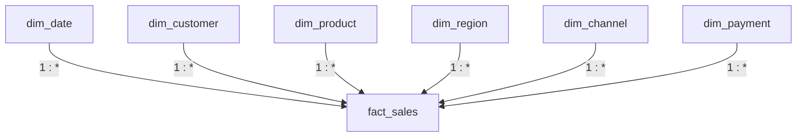

# Dimensional Model

## 1. Overview

The Gold layer of this project uses a dimensional star schema optimized for
analytical workloads in Microsoft Fabric and Power BI.

The model contains one central fact table and six dimensions:

```text
fact_sales
dim_date
dim_product
dim_customer
dim_region
dim_channel
dim_payment
```

The model is consumed through a Direct Lake semantic model.

---

## 2. Star Schema



The semantic model uses single-direction filtering:

```text
Dimension -> Fact
```

This keeps filter propagation predictable and avoids unnecessary
bi-directional relationships.

---

## 3. Fact Table Grain

The grain of `fact_sales` is:

> One row represents one order.

This grain was validated before and after dimensional joins.

```text
Source rows:        20,000
Fact rows:          20,000
Distinct order_id:  20,000
```

Therefore:

```text
1 order_id = 1 fact row
```

in the current dataset.

Maintaining the fact-table grain is critical because an incorrect dimension
join can multiply fact records and produce incorrect analytical results.

---

## 4. Fact Table

Table:

```text
dbo.fact_sales
```

Main columns include:

```text
order_id

date_key
customer_key
product_key
region_key
channel_key
payment_key

source_product_id

quantity
unit_price
discount_pct
gross_sales
discount_amount
net_sales

order_status
is_completed_order
```

The fact table stores:

- foreign keys to analytical dimensions
- additive and semi-additive business measures
- transaction status
- selected source identifiers for traceability

---

## 5. Dimension Tables

### 5.1 dim_date

Grain:

> One row per calendar date.

Observed size:

```text
365 rows
```

Date range:

```text
2025-01-01
to
2025-12-31
```

Main attributes:

```text
date_key
full_date
year
quarter
month_number
month_name
day_of_month
day_name
```

The surrogate date key is generated in:

```text
yyyyMMdd
```

format.

Example:

```text
20250101
```

for:

```text
2025-01-01
```

The date dimension provides a centralized structure for time-based reporting
instead of repeatedly deriving year, month, quarter, and day attributes in
Power BI.

---

### 5.2 dim_product

Grain:

> One row per logical product name/category combination.

Observed size:

```text
30 rows
```

Columns:

```text
product_key
product_name
category
```

The original assumption was:

```text
product_id -> product
```

However, profiling showed that this dependency was not valid.

Observed results:

```text
Distinct product IDs:              899
Distinct product names:             30
Distinct categories:                 6
Distinct source combinations:   14,134
```

A single `product_id` could be associated with multiple product names and
categories.

Therefore, source `product_id` was not used as the business key of the Gold
product dimension.

Profiling instead showed:

```text
product_name -> category
```

was stable for the observed dataset.

The Gold product dimension therefore uses the stable product-name/category
relationship.

The original source product ID is retained in `fact_sales` as:

```text
source_product_id
```

for traceability.

---

### 5.3 dim_customer

Grain:

> One row per distinct customer_id.

Observed size:

```text
7,324 rows
```

Columns:

```text
customer_key
customer_id
```

Region is intentionally not stored in this dimension.

Profiling showed that the same customer could appear in multiple regions.

Therefore:

```text
customer_id -> region
```

was not considered a stable functional dependency.

---

### 5.4 dim_region

Grain:

> One row per distinct region.

Observed size:

```text
3 rows
```

Values:

```text
Central
North
South
```

Columns:

```text
region_key
region
```

Region is modeled separately because it represents a transactional analytical
attribute rather than a permanent customer attribute in the observed dataset.

---

### 5.5 dim_channel

Grain:

> One row per sales channel.

Observed size:

```text
3 rows
```

Values:

```text
Website
Mobile App
Marketplace
```

Columns:

```text
channel_key
sales_channel
```

---

### 5.6 dim_payment

Grain:

> One row per payment method.

Observed size:

```text
4 rows
```

Values:

```text
Cash on Delivery
E-Wallet
Credit Card
Bank Transfer
```

Columns:

```text
payment_key
payment_method
```

---

## 6. Dimension Sizes

Current Gold dimension sizes:

| Dimension | Rows |
|---|---:|
| dim_product | 30 |
| dim_customer | 7,324 |
| dim_region | 3 |
| dim_channel | 3 |
| dim_payment | 4 |
| dim_date | 365 |

These counts were validated after Gold generation.

---

## 7. Surrogate Keys

The analytical dimensions use surrogate keys:

```text
date_key
customer_key
product_key
region_key
channel_key
payment_key
```

The fact table references these surrogate keys instead of relying entirely on
source-system identifiers.

Benefits include:

- isolation from unstable source identifiers
- compact analytical joins
- simpler semantic-model relationships
- flexibility for future dimensional history

---

## 8. Current Surrogate-Key Implementation

For this portfolio-scale full-refresh implementation, most dimension surrogate
keys are generated using:

```sql
ROW_NUMBER() OVER (ORDER BY ...)
```

Example:

```sql
ROW_NUMBER() OVER (
    ORDER BY customer_id
) AS customer_key
```

This is acceptable for the current project because the Gold tables are rebuilt
as a complete snapshot.

However, this approach has an important limitation.

When new dimension members are introduced, `ROW_NUMBER()` can potentially
assign different key values during a later rebuild.

Therefore, it should not be considered a production-grade persistent surrogate
key strategy.

---

## 9. Production Surrogate-Key Strategy

For an incremental production system, a more stable approach would be used.

Possible strategies include:

```text
MERGE-based dimension maintenance
Persistent identity keys
Sequence-generated surrogate keys
Stable hash keys
```

A typical production process would:

```text
1. identify existing dimension members
2. retain their current surrogate keys
3. insert only new members
4. assign new keys only to new members
```

This prevents surrogate keys from changing between pipeline executions.

---

## 10. Referential Integrity Validation

After creating the Gold model, all fact foreign keys were validated.

Results:

```text
fact rows             20,000
distinct orders       20,000

missing date_key           0
missing customer_key       0
missing product_key        0
missing region_key         0
missing channel_key        0
missing payment_key        0
```

This proves that every fact row successfully mapped to all required dimensions.

---

## 11. Fact Row Multiplication Check

A major risk during dimensional modeling is joining a fact table to a dimension
using a non-unique key.

For example, joining the original product dimension using only:

```sql
s.product_id = p.product_id
```

would have been unsafe because one source product ID could match multiple
product records.

This could produce:

```text
1 source fact row
x
multiple dimension matches
=
multiple fact rows
```

and inflate analytical measures.

Profiling prevented this issue before the Gold model was finalized.

After the final model was built:

```text
fact rows        = 20,000
distinct orders  = 20,000
```

confirming that no row multiplication occurred.

---

## 12. Business Measures

The fact table supports reusable semantic-model measures.

Important measures include:

```text
Completed Revenue
Total Orders
Completed Orders
Cancelled Orders
Returned Orders
Average Order Value
Completed Quantity
Return Rate
Cancellation Rate
```

Completed Revenue intentionally uses only:

```text
order_status = 'Completed'
```

rather than treating cancelled or returned orders as realized revenue.

This business rule is centralized in the semantic model instead of being
implemented separately in individual Power BI visuals.

---

## 13. Relationship Design

Semantic-model relationships follow:

```text
Dimension
    1
    |
    *
Fact
```

All six dimension relationships are active.

Cross-filter direction:

```text
Single
```

from dimension to fact.

Bi-directional filtering is avoided because it is not required by the current
star schema and could introduce ambiguous filter paths in more complex models.

---

## 14. Modeling Decisions Driven by Profiling

Two important dimensional assumptions changed after profiling.

### Product

Initial assumption:

```text
product_id uniquely identifies product
```

Observed data:

```text
False
```

Final decision:

```text
dim_product uses stable product_name/category relationship
```

### Customer

Initial assumption:

```text
customer_id uniquely determines region
```

Observed data:

```text
False
```

Final decision:

```text
dim_customer and dim_region are separate dimensions
```

This project therefore follows the principle:

> Profile source relationships before choosing dimensional business keys.

---

## 15. Current Limitations

The current Gold model is intentionally designed for a portfolio-scale,
full-refresh workload.

Current limitations include:

```text
No Slowly Changing Dimension implementation
No incremental dimension MERGE strategy
ROW_NUMBER surrogate keys are rebuild-dependent
No historical customer attribute tracking
No dedicated order-status dimension
No unknown-member surrogate rows
```

These limitations are acceptable for the current scope but would need to be
addressed before treating the implementation as production-grade.

---

## 16. Future Improvements

Potential improvements include:

```text
Persistent surrogate-key generation
Incremental MERGE processing
Slowly Changing Dimension Type 2
Unknown / default dimension members
Effective-from and effective-to dates
Data lineage metadata
Automated referential-integrity tests
Incremental fact loading
```

These enhancements would allow the model to support evolving source data and
larger production workloads more reliably.

---

## 17. Final Gold Model

```text
                         dim_date
                            |
                            |
dim_customer ----------- fact_sales ----------- dim_product
                            |
                +-----------+-----------+
                |           |           |
            dim_region  dim_channel  dim_payment
```

Current validation:

```text
20,000 source orders
20,000 Gold fact rows
0 missing dimension keys
0 duplicated orders introduced by dimension joins
```

The Gold model is therefore structurally consistent with the observed source
data and ready for analytical consumption through Direct Lake and Power BI.